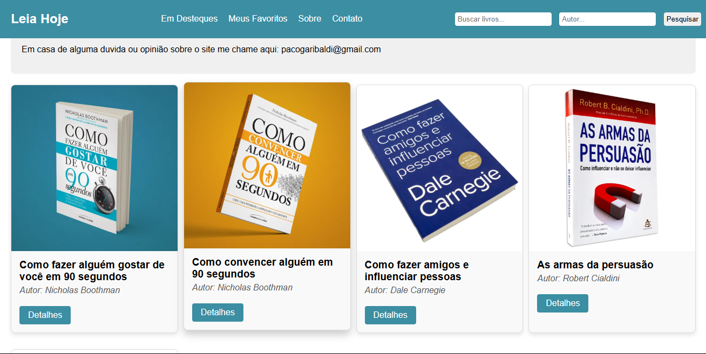
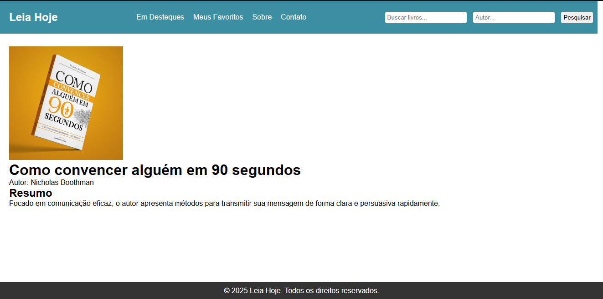
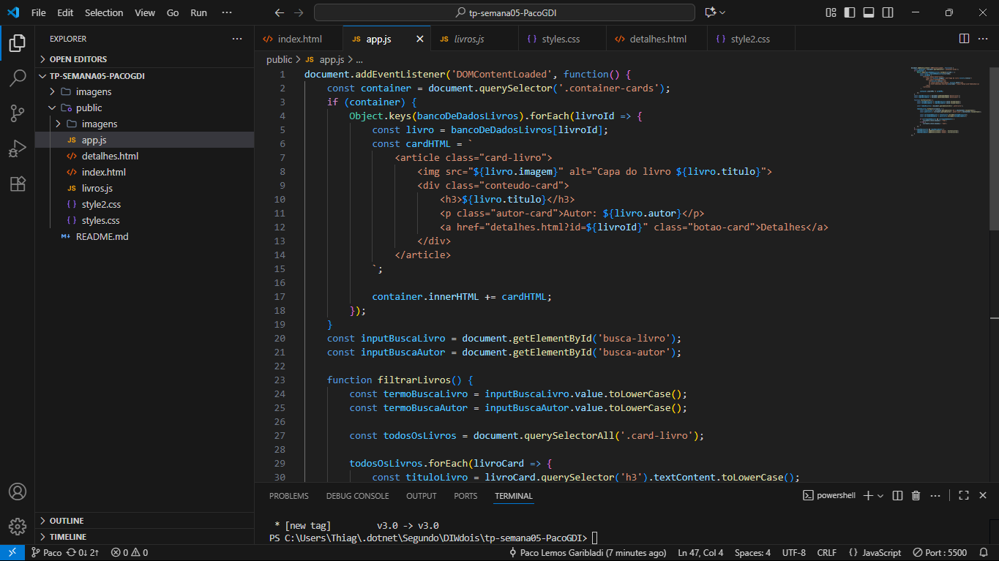
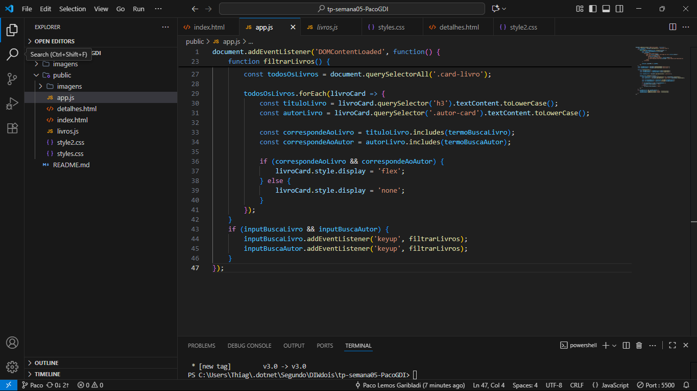

## Informações Gerais

- Nome:Paco Lemos Garibaldi
- Matricula: 889719
- Proposta de projeto escolhida: Autores e livros.
- Breve descrição sobre seu projeto: A Leia Hoje é uma plataforma dedicada a conectar leitores com livros que transformam vida, além de agregar conteudo significante em sua vida.

## Print da pagina incial

## Print do codigo app.js

